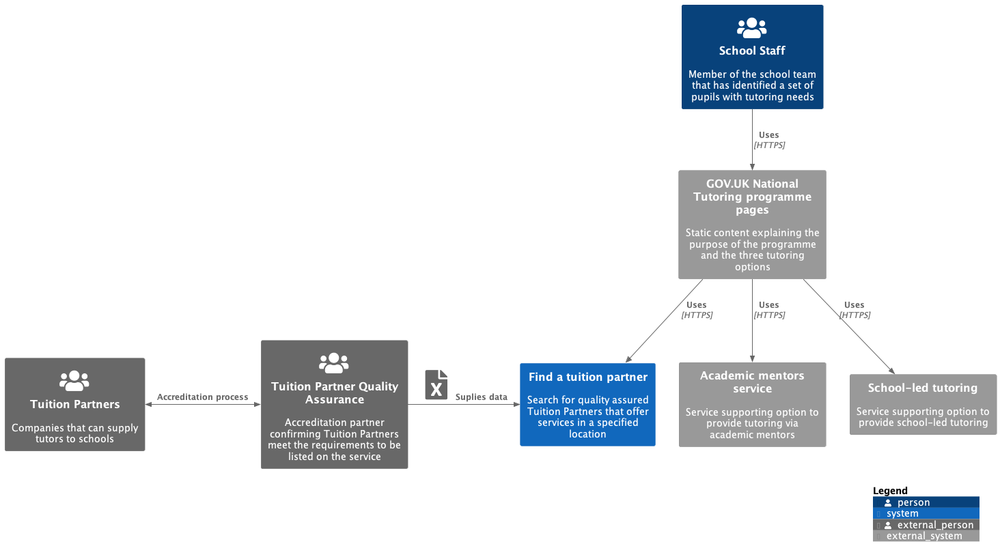

# Find a Tuition Partner

## Introduction

The National Tutoring Programme supports state-funded schools in their work to help young people who have had their education disrupted by coronavirus (COVID-19).

There are three funded options for tutoring; engaging Tuition Partners to supply professional tutors, using Academic Mentors and via School-Led Tutoring. Find a tuition partner is the service covering the first option and the remaining two options are being built by other suppliers. The three options will be explained and linked to from a set of GOV.UK pages connecting the programme together.

The code in this repository is for the find a tuition partner service. This service provides the ability to search the full list of quality assured Tuition Partners using the school's location and tutoring needs.

## Further documentation

* [Architectural Decision Records (ADR)](docs/decisions)
* [Runbooks](docs/runbooks)
* [C4 Diagrams](docs/uml)
* [Release Process](docs/release-process.md)
* [Errors and Bugs](docs/errors-and-bugs.md)
* [Disaster Recovery](docs/runbooks/disaster-recovery.md)

## Architecture

### C1 System Context Diagram



### C2 Container Level Diagram


## Development environment setup

### Tooling requirements

* .NET 6
* [Docker Desktop](https://www.docker.com/products/docker-desktop/)
* [NodeJS LTS](https://nodejs.org/en/download/)

You also require the [Entity Framework Core Tools for the .NET Command-Line Interface](https://www.nuget.org/packages/dotnet-ef/) to manage database migrations. Install or update these using the following commands:

```
dotnet tool install -g dotnet-ef
dotnet tool update -g dotnet-ef
```

### Database

The service uses Postgres 13 for the database backing service. It is recommended that you use a pre built docker image for local development. Run the following command to start the container.

```
docker run --name find-a-tuition-partner-postgres-db -e POSTGRES_PASSWORD=<LOCAL_DEV_PASSWORD> -p 5432:5432 -d postgres:13
```

Please note that you will need to start the container from the Docker Desktop container tab every time you restart your machine.

You will need to register the database connection string for local development as a .NET user secret with the following command.

```
dotnet user-secrets set "ConnectionStrings:FatpDatabase" "Host=localhost;Username=postgres;Password=<LOCAL_DEV_PASSWORD>;Database=fatp" -p UI
```

#### Azure Blob Storage Configs

The Tuition Partner data is imported from a container in Azure Blob Storage.

**You must get a client secret and run the four `dotnet user-secrets set` commands below for the import process to work. To request the client secret, please contact the project lead.**

You can then use the following commands to add the necessary user secrets after obtaining the client secret:

```
dotnet user-secrets set "AzureBlobStorage:ClientSecret" "<will be shared privately>" -p UI
dotnet user-secrets set "AzureBlobStorage:AccountName" "s177p01sharedtpdata" -p UI
dotnet user-secrets set "AzureBlobStorage:ClientId" "fdd09510-77b0-419f-b67c-2b5a25a073f0" -p UI
dotnet user-secrets set "AzureBlobStorage:TenantId" "9c7d9dd3-840c-4b3f-818e-552865082e16" -p UI
```

#### Data Import

The database migrations, seed data and Tuition Partner data is deployed by and running the data importer project. Either run the project via Visual Studio or with the following command.

```
dotnet run --project UI import
```

#### Migrations

The service uses Entity Framework Code First migrations to create the database schema and seed the database. The following commands are for reference when managing migrations

```
dotnet ef migrations add InitialCreate -p Infrastructure -s UI
dotnet ef migrations remove -p Infrastructure -s UI
dotnet ef database update -p Infrastructure -s UI
```

### Web assets

From a command prompt, change to the `UI` directory and run `npm install` to install the dependencies. Then run one of the following commands:

* `npm run build` to bundle the assets using webpack 5 in production mode
* `npm run build:dev` to bundle the assets using webpack 5 in development mode
* `npm run watch` to bundle the assets using webpack 5 in development mode and apply changes immediately when developing
* `npm run format` to apply prettier formatting to the web asset source files (js and sass) along with the cypress step definitions

### Running the application

The UI project should be the startup project. Either run the project via Visual Studio or with the following command.

```
dotnet run --project UI
```

You can then access the application on [https://localhost:7036/](https://localhost:7036/)

## Logging and Metrics

The service uses [Serilog](https://github.com/serilog/serilog) to support logging structured event data. It is configured to write logs to the console as default and optionally write to a TCP sink for logit.io data source integration.

### logit.io

[logit.io](logit.io) provides the ELK stack (Elasticsearch, Logstash, and Kibana) and Grafana as a service. The service ships logs to the find a tuition partner stack in the NTP account which is what new developers and analysts should request access to.

Log interrogation is provided by OpenSearch and metrics dashboards are configured in Grafana. logit.io provides alerting within its service however Grafana can also be configured to send alerts if required.

If you need to test logit.io integration from your development environment, use the following command to add the neccessary user secret:

```
dotnet user-secrets set "AppLogging:TcpSinkUri" "<TLS_URL>" -p UI
```

### Google Tag Manager

Google Tag Manager is used to track service traffic and usage. There is a separate container per environment and therefore container id. The Google Analytics: GA4 Configuration tag type is set up within GTM to track page events via GA4.

If you need to test Google Tag Manager integration from your development environment, use the following command to add the neccessary user secret:

```
dotnet user-secrets set "GoogleTagManager:ContainerId" "<CONTAINER_ID>" -p UI
```

### Google Analytics (GA4 - superseded by GTM)

Google Analytics was historically used directly to track service traffic and usage. It is now added via Google Tag Manager as explained above. There is a separate property per environment with an associated data stream and therefore measurement id.

If you need to test Google Analytics integration from your development environment, use the following command to add the neccessary user secret:

```
dotnet user-secrets set "GoogleAnalytics:MeasurementId" "<MEASUREMENT_ID>" -p UI
```

### DfE Analytics

The service can also use https://github.com/DFE-Digital/dfe-analytics (via https://github.com/DFE-Digital/dfe-analytics-dotnet) to log all web requests to a Google BigQuery database.

Analytics collection will be disabled if the necessary configuration is not present.

If you need to test the analytics collection from your development environment, you will need the service account credentials with `updateData` rights on the `fatp_events_development` BigQuery dataset (see the https://github.com/DFE-Digital/dfe-analytics setup guide).

You can then use the following commands to add the neccessary user secrets:

```
dotnet user-secrets set "DfeAnalytics:CredentialsJsonFile" "<PATH_TO_THE_BIGQUERY_APPENDER_SERVICE_ACCOUNT_KEY>" -p UI
dotnet user-secrets set "DfeAnalytics:ProjectId" "find-a-tuition-partner" -p UI
dotnet user-secrets set "DfeAnalytics:DatasetId" "fatp_events_development" -p UI
```

## Testing

### End To End Testing

#### PR Workflow

The full suite of end to end tests is run automatically for every opened PR branch using [this workflow](/.github/workflows/pull-request.yml)

#### Running Locally

From a command prompt, change to the `UI` directory and run `npm install` to install the dependencies. Then run one of the following commands:

* `npx cypress run` to run all Cypress end to end tests in a headless browser
* `npx cypress open` to open the Cypress test runner for fully manual configuration of the test runner
* `npx cypress open --config baseUrl=https://my-url/ --env username=<USERNAME>,password=<PASSWORD>` to open the Cypress test runner specifying a different base url and basic HTTP authentication credentials

### Docker Compose

It is also possible to test the full stack from within docker using docker compose. This method supports easy setup and teardown of the database and can be a good way to test database migrations and updated data. The following commands will run all unit tests, start the stack, run the migrations, import the data and run the end to end tests.

Note the key file and ids that need replacing in the following command can be found in the [Google Cloud Service Account Key file](#google-cloud-service-account-key-file) section.

```
dotnet test
docker compose up --build -d
docker compose run -v <PATH_TO_SERVICE_ACCOUNT_KEY_FILE>:/app/credentials.json -e GoogleDrive:SharedDriveId=<ID> -e GoogleDrive:TuitionPartnerDataFolderId=<ID> -e GoogleDrive:TuitionPartnerLogosFolderId=<ID> web ./UI import
cd UI
npx cypress run --config baseUrl=http://localhost:8080/
cd ..
```

### Accessibility Testing

Axe has been integrated with the Cypress end to end tests using [cypress-axe](https://github.com/component-driven/cypress-axe). This provides a basic level of automated accessibility testing for every scenario in the suite. See [accessibility.js](/UI/cypress/support/step_definitions/accessibility.js) to understand how this is configured and run. Accessibility violations are logged to the browser's console meaning that diagnosing a violation requires running the tests locally and [viewing the error in the DevTools console](https://github.com/component-driven/cypress-axe#standard-output)

Please note: This automated accessibility testing is not sufficient to replace manual testing by the team and a full external accessibility audit. The dev team should also use the following tools locally to confirm there are no accessibility violations prior to QA

* [axe DevTools](https://www.deque.com/axe/devtools/)
* [WAVE](https://wave.webaim.org/)

### Security Testing

The team currently use the following tools to aid manual security testing

* [OWASP Zed Attack Proxy](https://www.zaproxy.org/)

## GOV.UK PaaS

Follow the [Cloud Foundry command line set up guide](https://docs.cloud.service.gov.uk/get_started.html#set-up-the-cloud-foundry-command-line) to support managing the deployments locally.

The [Manual Environment Setup](docs/runbooks/manual-environment-setup.md) runbook details the commands used.

## Reporting

### Exporting anonymised enquiry data

There is a bash script which will export enquiry and response data to a CSV for analysis.

This uses conduit to connect to the production database in ready only mode from the local machine, and then runs some SQL to export the required data.

In order to use this you need to have the cloudfoundry CLI on your machine, and to have installed conduit:

```
cf install-plugin conduit
```

Once this has been installed, to export the data you:

Log in to `cf` if you haven't already

```
cf login
```

Once you have logged in, run the export script:

```
cd scripts
./export_enquiry_data.sh
```

The data will be exported into a new directory `scripts/exports/production/<date>/`

By default this will export data from the `production` environment. You can export data from other enqvironments if needed, e.g.
```
./export_enquiry_data.sh staging
```